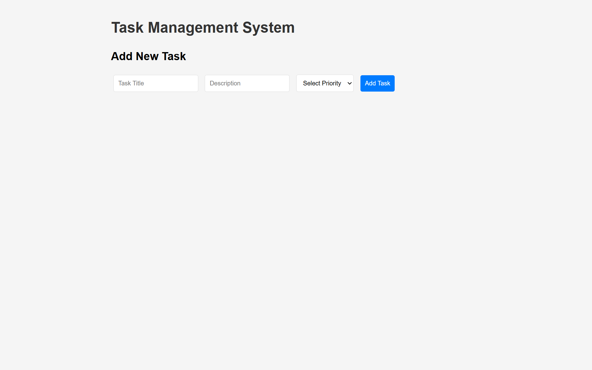
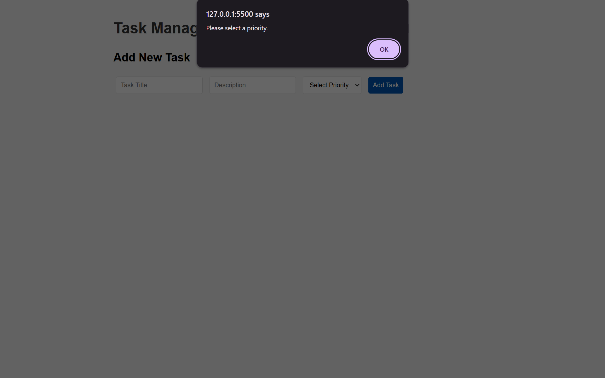
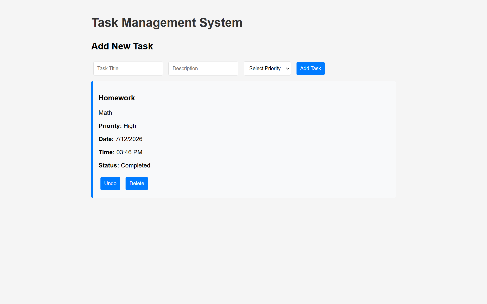
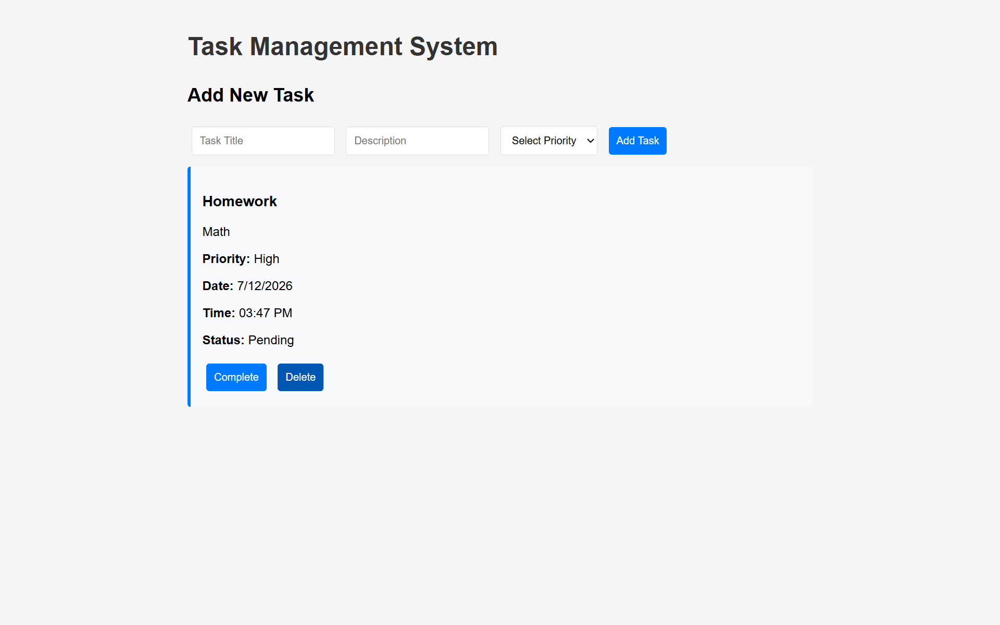
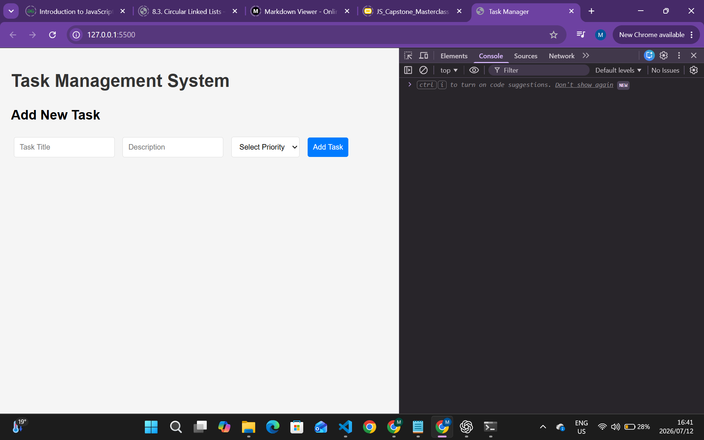
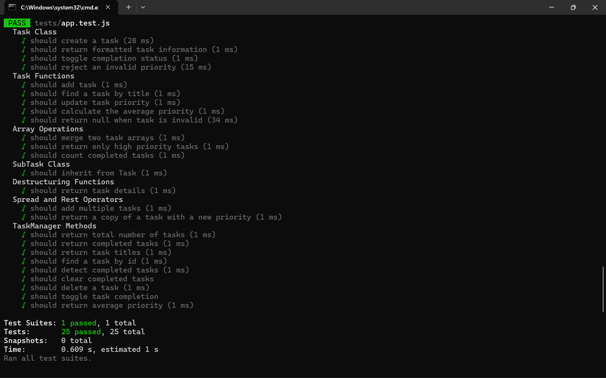
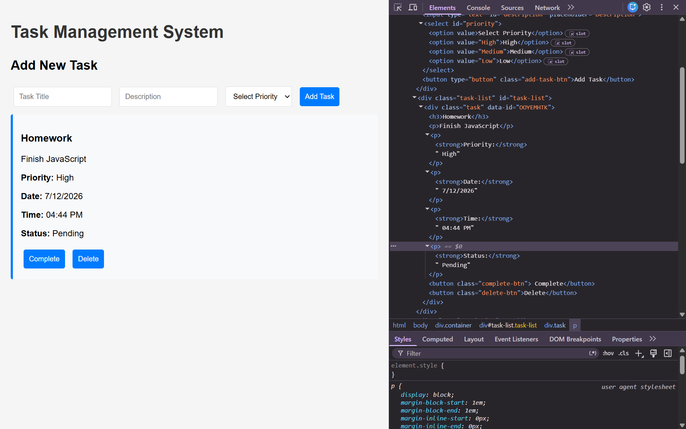
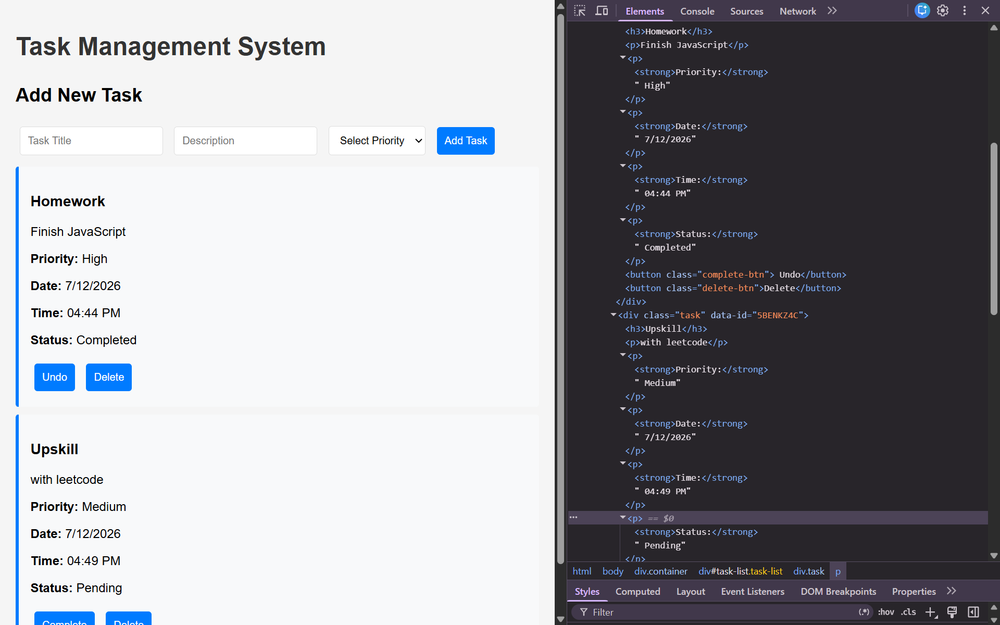

[](https://classroom.github.com/online_ide?assignment_repo_id=24194577&assignment_repo_type=AssignmentRepo)
# Task Management Application - Mataye Whitelhane

## Overview

This project is a JavaScript Task Management Application that was completed by fixing and improving an incomplete starter codebase. The application allows users to create, manage and organize tasks using modern JavaScript features.

Users can:
- Add new tasks
- Select a High, Medium or Low priority
- Mark tasks as completed
- Delete tasks
- Save tasks using localStorage
- Reload saved tasks when the application is opened again

The project demonstrates JavaScript fundamentals, object-oriented programming, DOM manipulation, ES6 features, error handling and automated testing using Jest.

---

## Errors Found

The starter code contained several issues that needed to be corrected.

### Variables and Operators
- Incorrect variable declarations
- Incorrect comparison operators
- Missing variable validation

### Control Flow
- Loop errors
- Missing conditional checks
- Incorrect logic in some functions

### Functions
- Missing function parameters
- Incorrect return values
- Recursive function missing a proper base case

### Object-Oriented Programming
- Task class missing properties
- Missing toggleCompletion() method
- Missing super() call in SubTask
- Missing TaskManager methods

### Modern JavaScript
- Missing destructuring
- Missing template literals
- Missing spread and rest operators
- Missing ES6 module structure

### DOM Manipulation
- Incorrect DOM selectors
- Missing event listeners
- Missing localStorage functionality

### Testing
- Incomplete Jest tests
- Missing edge case tests
- Missing beforeEach()

### Error Handling
- Missing try-catch blocks
- Missing parameter validation
- Limited code comments

---

## Fixes Implemented

The project was updated by:

- Replacing incorrect variables with let and const
- Replacing == with ===
- Adding validation for task information and priorities
- Adding unique IDs, creation dates and creation times
- Implementing Task and SubTask classes correctly
- Adding TaskManager methods
- Adding destructuring, template literals, spread and rest operators
- Organising the project using ES6 modules
- Implementing localStorage using JSON.stringify() and JSON.parse()
- Adding event listeners and event delegation
- Writing comprehensive Jest tests
- Adding try-catch blocks and meaningful error messages
- Improving comments and overall code readability

---

## Features Added

- High, Medium and Low priorities
- Automatic ID generation
- Automatic creation date and time
- Delete task functionality
- Toggle completed tasks
- High priority filtering
- Average priority calculation
- Task persistence using localStorage

---

## Running the Application

1. Clone the repository.

2. Install project dependencies.

```
npm install
```

3. Start the project using Live Server.

4. Open the browser to interact with the application.

---

## Running the Tests

Install dependencies if they have not already been installed.

```
npm install
```

Run all Jest tests.

```
npm test
```

All 25 tests should pass successfully.

---

## Test Results

- 25 passing Jest tests
- 0 failing tests
- Validation tests completed
- Edge case tests completed
- TaskManager methods tested
- Inheritance tested
- Recursive functions tested

---

## Screenshots

The repository includes screenshots showing:

- Application running 

- Form validation



- Adding tasks

- Completing tasks

- Delete functionality

- Console with no errors

- Passing Jest tests

- DOM manipulation features working



---

## Reflection

The most challenging part of this project was debugging the starter code and making sure every feature worked together correctly. The testing section also required careful debugging to ensure every test passed successfully. Working through each error one at a time helped identify the source of problems and made the application easier to improve and maintain.

